# MG Linker

## 项目介绍

MG Linker 是一款专为名爵(MG)和荣威(RW)汽车打造的Android桌面小组件应用。通过配合HttpCanary抓包工具获取车辆数据Token，实现车辆状态信息的实时展示。主要功能包括车辆续航里程、剩余油量/电量、车门锁状态、车内温度等关键信息的桌面快捷查看。

**适用车型：** MG7、MG5、MG4、荣威D7、荣威D5X 等上汽名爵/荣威系列车型

## 安装步骤

1. **下载安装应用**
   - 下载最新版本的[MG Linke](https://gitee.com/yangyachao-X/mg-linker/releases/download/3.5/MG%20Linker.apk)
   - 在手机上允许安装未知来源应用后完成安装

2. **准备抓包工具**
   - 下载并安装 [HttpCanary](https://pan.quark.cn/s/c3582382b19d) 
   - 安装MG Live或上汽荣威 官网APP

3. **获取车辆Token**（详细步骤见下方使用教程）

4. **配置应用**
   - 打开MG Linker应用
   - 选择您的车辆品牌(名爵/荣威)
   - 输入VIN码和抓取到的Token
   - 保存配置

5. **添加桌面小组件**
   - 长按手机桌面 → 添加小部件 → 找到MG Linker
   - 选择合适的组件尺寸添加到桌面
   - 配置成功后小组件将自动开始显示车辆数据
## 版本历史

| 版本  | 更新内容               |
|-----|--------------------|
| 3.5 | 最新版本；修复荣威车辆操控功能  |
| 1.0 | 初始版本；含调试版，包含详细日志输出 |

完整版本历史请访问 [Gitee Releases](https://gitee.com/yangyachao-X/mg-linker/releases)

## 问题反馈

如遇到问题，欢迎通过以下方式获取帮助：

- 加入抖音群聊交流


- 查看日志文件中的详细报错信息
- 下载调试版本复现问题后提交反馈

## 使用教程


### Token抓取步骤

使用HttpCanary抓取车辆数据的Token是配置成功的关键。请按照以下步骤操作：

1. **启动HttpCanary**
   - 打开HttpCanary应用
   - 开始抓包
   - 切换到MG Live APP/上汽荣威APP进行是刷新操作
2. **定位请求**
   - 在抓包记录中找到形如示例请求:
   - 抓取ACCESS_TOKEN:指定域名的请求头中: `https://mp.ebanma.com/xxxxxx`
   - 抓取user_id,user_name:指定接口的返回值中(点开app中“我的”，找到以下接口，返回值中的uid就是user_id,username就是user_name): 
   - `https://capi-pv.saicmotor.com/app-mp/uais/1.1/fetchCcmUserInfoV2`
   - 记录抓包数据
   - token值以-prod_SAIC结尾
3. **获取VIN码**
   - 在同一请求或App相关页面中找到车辆VIN码
   - VIN码通常以LSJ开头，共17位
4. **抓包演示图**
   - 步骤1

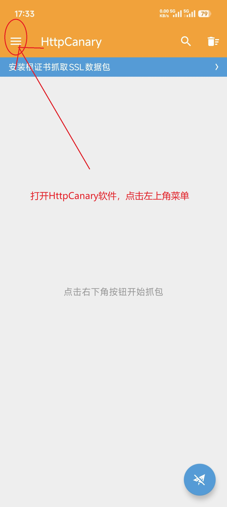


   - 步骤2

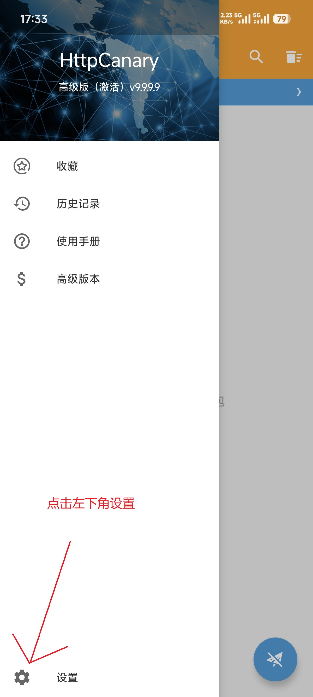


   - 步骤3

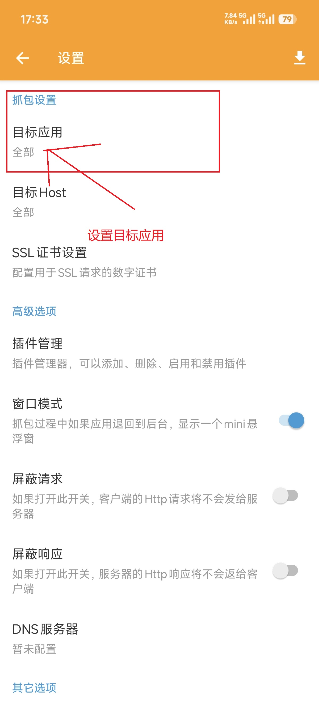


   - 步骤4（名爵车系选择MG Live App；荣威车系选择上汽荣威 App）

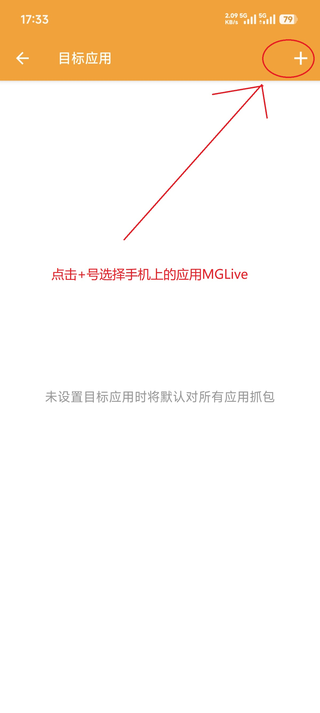


   - 步骤5


   - 步骤6

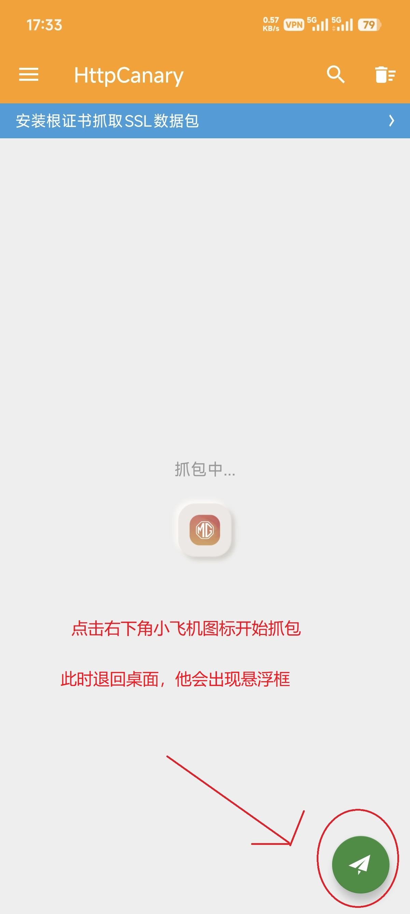


   - 步骤7
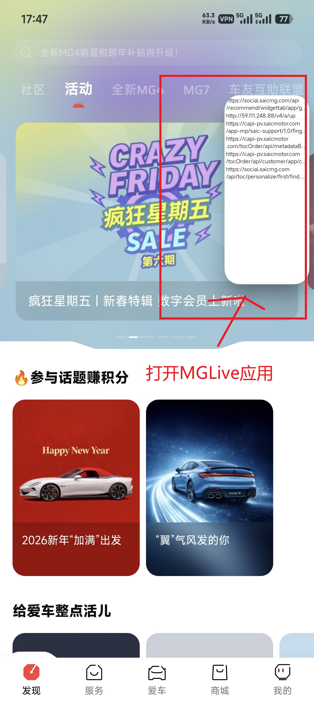


   - 步骤8

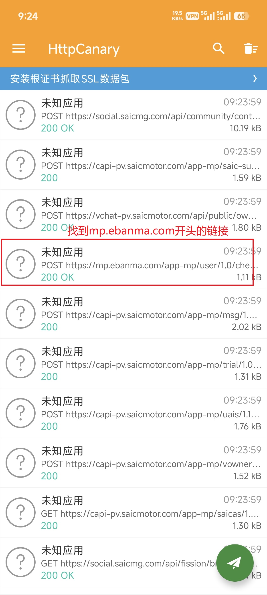


   - 步骤9

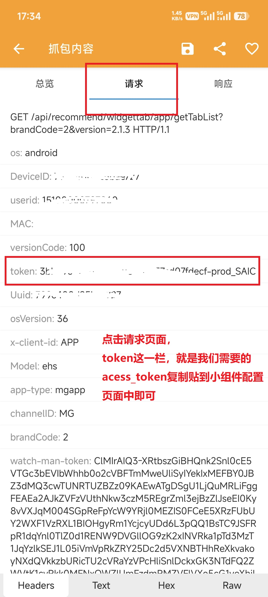


   - 步骤10

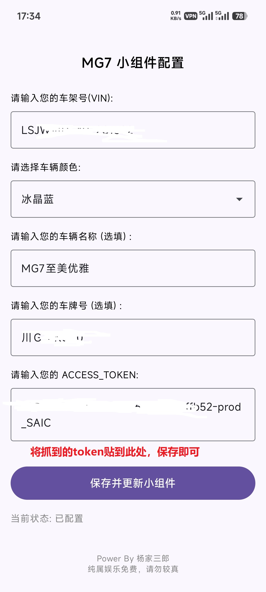

  - 步骤11车控新增抓取：user_name与user_id

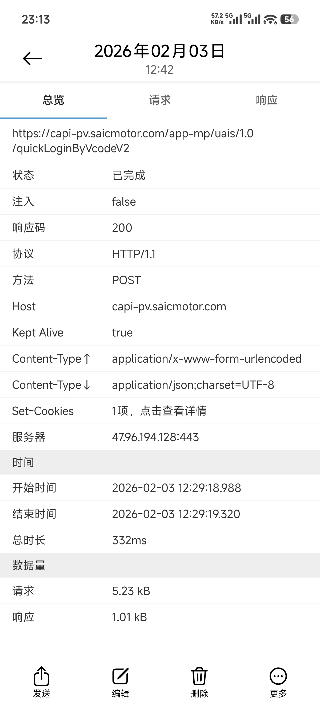

  - 步骤12

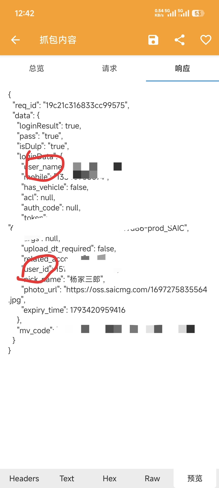


### 应用配置界面说明

应用主界面提供以下配置项：

| 配置项 | 说明 |
|--------|------|
| **品牌选择** | 选择名爵或荣威品牌 |
| **车型选择** | 选择具体车型如MG7、D7等 |
| **颜色选择** | 选择车辆外观颜色(影响展示图标) |
| **Token输入** | 粘贴从抓包获取的token |
| **VIN码输入** | 输入17位车辆识别码 |
| **检查更新** | 手动触发版本更新检查 |

## 核心功能

- **实时车辆状态监控**：在桌面小组件中展示车门开关状态、锁车状态、续航里程、油耗/电量信息
- **多尺寸组件支持**：提供图标型、小尺寸、标准型等多种尺寸的桌面小组件
- **多种展示风格**：支持多种样式的组件布局，满足不同用户需求
- **品牌智能适配**：支持名爵和荣威两个品牌的车辆配置切换
- **能耗计算功能**：自动计算并显示油耗/电耗数据
- **位置信息解析**：自动将GPS坐标解析为实际地址显示
- **自动更新机制**：通过Gitee Release自动检测并下载最新版本
- **完善日志系统**：内置详细的运行日志记录，便于问题排查
- **深色主题适配**：自动跟随系统深色/浅色主题切换

## 技术架构

### 技术栈

| 技术 | 说明 |
|------|------|
| **开发语言** | Kotlin |
| **UI框架** | Jetpack Compose |
| **目标SDK** | Android API 34 |
| **构建工具** | Gradle with Kotlin DSL |
| **包名** | com.my.mg |
| **网络库** | OkHttp |
| **JSON解析** | Gson |
| **后台任务** | CoroutineWorker |

### 项目结构


```
mg-linker/
├── app/src/main/
│   ├── java/com/my/mg/
│   │   ├── MainActivity.kt           # [核心入口] App 主容器 / Compose 宿主 / 权限请求与页面导航
│   │   ├── MainViewModel.kt          # [架构-VM] MVVM ViewModel / 管理 UI 状态 (MainUIState) / 协调数据与后台任务
│   │   ├── MGWidget.kt               # [小组件] 4x2 标准/图标小组件 Provider / 负责接收广播与点击事件
│   │   ├── MGWidgetSmall.kt          # [小组件] 2x2 小型小组件 Provider / 续航版组件逻辑
│   │   ├── config/
│   │   │   └── CarConfig.kt          # [配置] 车辆静态配置 / 车型常量定义
│   │   ├── data/
│   │   │   ├── VehicleData.kt        # [模型] 车辆核心数据实体 (JSON 映射: 续航、电量、胎压等)
│   │   │   ├── MainUIState.kt        # [模型] UI 状态封装 (Loading、车辆信息、下载进度)
│   │   │   ├── WidgetContextData.kt  # [模型] 小组件渲染上下文 / 聚合车辆数据、地址与用户配置
│   │   │   ├── FuelRecord.kt         # [模型] 能耗记录实体 / 用于计算加油与耗电历史
│   │   │   ├── CarConfig.kt          # [模型] 车辆配置数据模型
│   │   │   └── GiteeRelease.kt       # [模型] 版本更新接口响应结构
│   │   ├── log/
│   │   │   └── LogcatHelper.kt       # [工具] 日志系统 / 抓取 Logcat、写入文件及 UI 实时流展示
│   │   ├── net/
│   │   │   ├── VehicleDataWorker.kt  # [网络] 车辆 API 服务 / SAIC 接口鉴权与数据获取
│   │   │   ├── AiService.kt          # [网络] AI 服务 / AI对话接口封装
│   │   │   ├── AddressWorker.kt      # [网络] 逆地理编码 / GPS 坐标转中文地址
│   │   │   └── ImageWorker.kt        # [网络] 图片服务 / 车辆渲染图下载与缓存
│   │   ├── ui/
│   │   │   ├── MainComponents.kt     # [界面] 首页组件 / 车辆卡片、配置表单、弹窗
│   │   │   ├── LogViewerScreen.kt    # [界面] 日志监控页 / 实时日志流、AI 智能分析入口
│   │   │   └── theme/                # [界面] Compose 主题配置
│   │   │       ├── Color.kt          # 颜色定义
│   │   │       ├── Theme.kt          # 主题逻辑
│   │   │       └── Type.kt           # 字体排版
│   │   ├── util/
│   │   │   ├── EnergyCalculator.kt   # [算法] 能耗计算引擎 / 油电折算逻辑
│   │   │   └── FuelRecordStore.kt    # [存储] 本地持久化 / 管理能耗历史记录 (SharedPreferences)
│   │   └── worker/
│   │       ├── WidgetUpdateWorker.kt # [后台] 组件更新任务 / 周期性拉取数据并刷新所有 Widget
│   │       └── EnergyRecordWorker.kt # [后台] 能耗记录任务 / 定期采集车辆状态用于分析
│   └── res/
│       ├── layout/                   # [布局] RemoteViews XML (小组件专用)
│       │   ├── mg_widget.xml         # [布局] 4x2 标准布局
│       │   ├── mg_widget_icon.xml    # [布局] 4x2 图标版布局
│       │   ├── mg_widget_small.xml   # [布局] 2x2 紧凑布局
│       │   └── mg_info_widget.xml    # [布局] 详细信息面板
│       ├── xml/                      # [配置] Widget 元数据
│       │   ├── mg_widget_info*.xml   # [配置] 定义组件尺寸、预览图、更新频率
│       │   └── ...                   
│       ├── drawable*/                # [资源] 车辆状态图标与素材
│       │   ├── detailspage_*.png     # [资源] 车辆透视图部件 (车门、车窗、轮毂)
│       │   └── homepage_*.png        # [资源] 首页车辆状态图层
│       └── values/                   # [资源] 基础资源 (Strings, Colors)
├── HttpCanary/                       # 抓包工具及教程资源
└── gradle/                           # 构建脚本

```

## 快速开始

### 环境要求

- Android Studio Hedgehog (2023.1.1) 或更高版本
- Android SDK 34
- Gradle 8.4+
- JDK 17

## API接口说明

应用通过以下接口获取车辆状态信息：

```
POST https://mp.ebanma.com/app-mp/vp/1.1/getVehicleStatus
```

**请求参数：**

| 参数 | 必填 | 说明 |
|------|------|------|
| timestamp | 是 | 时间戳(毫秒) |
| token | 是 | 身份令牌 |
| vin | 是 | 车辆识别码 |

**返回数据字段说明：**

```kotlin
// 车辆位置信息
data class VehiclePosition(
    val latitude: String?,      // 纬度
    val longitude: String?,     // 经度
    val gps_status: Int?,       // GPS状态 (2:定位成功)
    val satellites: Int?,       // 卫星数量
    val altitude: Int?,         // 海拔高度(米)
    val hdop: Int?,             // 水平精度因子
    val update_time: Long?      // 更新时间
)

// 车辆数值数据
data class VehicleValue(
    val fuel_level_prc: Int?,        // 燃油百分比
    val fuel_range: Int?,            // 燃油续航(km)
    val driving_range: Int?,         // 综合续航(km)
    val odometer: Int?,              // 里程表(km)
    val battery_pack_prc: Int?,      // 电池百分比
    val battery_pack_range: Int?,    // 电池续航(km)
    val interior_temperature: Double?, // 车内温度
    val exterior_temperature: Int?,    // 车外温度
    val chrgng_rmnng_time: Int?,       // 充电剩余时间
    val charge_status: Int?,           // 充电状态
    val speed: Int?,                   // 车速(km/h)
    val vehicle_battery: Int?,         // 车辆电池电压(V)
    val front_left_tyre_pressure: Int?,  // 左前轮胎压(kPa)
    val front_right_tyre_pressure: Int?, // 右前轮胎压(kPa)
    val rear_left_tyre_pressure: Int?,   // 左后轮胎压(kPa)
    val rear_right_tyre_pressure: Int?   // 右后轮胎压(kPa)
)

// 车辆状态数据
data class VehicleState(
    val lock: Boolean?,            // 锁车状态
    val door: Boolean?,            // 车门状态(任意车门)
    val driver_door: Boolean?,     // 驾驶位车门
    val passenger_door: Boolean?,  // 副驾驶车门
    val rear_left_door: Boolean?,  // 左后车门
    val rear_right_door: Boolean?, // 右后车门
    val boot: Boolean?,            // 后备箱状态
    val sunroof: Boolean?,         // 天窗状态
    val window: Boolean?,          // 车窗状态(任意车窗)
    val engine: Boolean?,          // 发动机状态
    val charge: Boolean?,          // 充电状态
    val climate: Boolean?,         // 空调状态
    val light: Boolean?,           // 大灯状态
    val update_time: Long?         // 更新时间
)
```


## 常见问题

### Q: 小组件显示"获取数据失败"
A: 请检查Token和VIN码是否正确填写；确认车辆App登录状态有效；尝试重新抓取Token（Token可能过期）

### Q: 小组件不刷新
A: 检查应用是否授予后台运行权限；在设置-应用管理-MG Linker中开启"自启动"权限

### Q: 保存未生成桌面小部件
A: 检查应用是否授予桌面快捷方式权限；在设置-应用管理-MG Linker中开启"桌面快捷"权限；或者手动长按桌面添加小部件选择MG Linker

### Q: 抓包获取不到Token或者获取到正确的Token仍然无法刷新
A: 确保使用正确版本的官方App；荣威车型需要抓取特定接口；未抓包状态下，尝试完整操作一遍App登录流程，操作App上所有的功能点，例如商城，服务，权益，车辆信息等，再重新抓取Token

### Q: 日志文件位置
A: 调试版日志保存在 `Android/data/com.my.mg/files/logs/MGLinker_log.txt`

## 许可证

本项目遵循 Apache License 2.0 许可证。